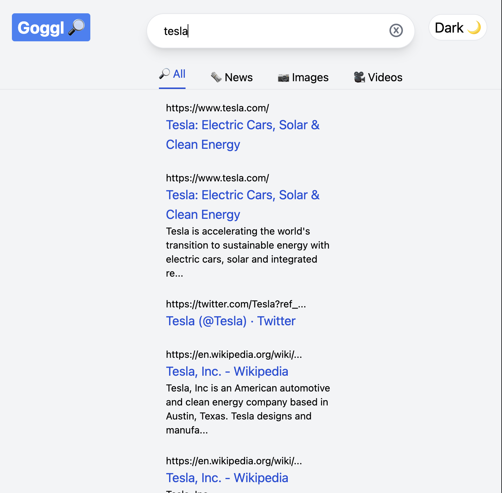

# goggl

 

</a>

 

# Summary

This is a project inspired by google. Uses rapid api to fetch the data. It has a dark and white appearance and you can search like the original search engine does.

# License

This project is licensed under the [MIT license](LICENSE).
